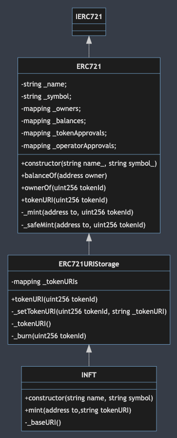
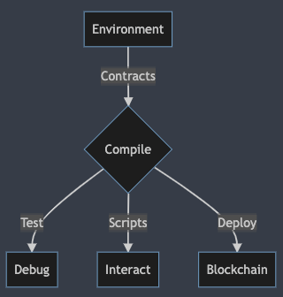

# INFT

## Table of contents

<!--ts-->

- [INFT](#inft)
  - [Table of contents](#table-of-contents)
  - [Introduction](#introduction)
    - [ERC721 (Non-Fungible Token Standard) Proposal](#erc721-non-fungible-token-standard-proposal)
    - [Motivation](#motivation)
  - [Development](#development)
    - [Getting Started](#getting-started)
    - [Contracts](#contracts)
    - [Hardhat](#hardhat)
  - [Requirements](#requirements)
  - [API](#api)
  - [Test Cases](#test-cases)
  - [Design](#design)
  - [References](#references)
  - [Citations](#citations)
  <!--te-->

## Introduction

This is an experimental ethereum development environment for developing NFT contracts.
The contracts were developed with the [Hardhat](https://hardhat.org) framework and is a subclass of the [OpenZeppelin](https://openzeppelin.com/) contract library. All contracts implemented are MIT Licesesed.

_If you're new to smart contract development, head to [Developing Smart Contracts](https://docs.openzeppelin.com/learn/developing-smart-contracts)._

ERC-721 defines a minimum interface a smart contract must implement to allow unique tokens to be managed, owned, and traded. It does not mandate a standard for token metadata or restrict adding supplemental functions.

First, the INFT contract is a subclass of OpenZeppelin's
[ERC721URIStorage](https://github.com/OpenZeppelin/openzeppelin-contracts/blob/master/contracts/token/ERC721/extensions/ERC721URIStorage.sol)
which is a subclasss of [ERC721](https://github.com/OpenZeppelin/openzeppelin-contracts/blob/master/contracts/token/ERC721/ERC721.sol).



<br/>

### ERC721 (Non-Fungible Token Standard) Proposal

The authors of ERC-721 are William Entriken, Dieter Shirley, Jacob Evans, and Nastassia Sachswas.
created on 2018-01-24

In brief, according to their [proposal](https://eips.ethereum.org/EIPS/eip-721):

> "An ERC721 is a standard interface for non-fungible tokens, also known as deeds."

> "We considered use cases of NFTs being owned and transacted by individuals as well as consignment to third party brokers/wallets/auctioneers (“operators”). NFTs can represent ownership over digital or physical assets. We considered a diverse universe of assets, and we know you will dream up many more:

> - Physical property — houses, unique artwork
> - Virtual collectables — unique pictures of kittens, collectable cards
> - “Negative value” assets — loans, burdens and other responsibilities

> In general, all houses are distinct and no two kittens are alike. NFTs are distinguishable and you must track the ownership of each one separately.

### Motivation

TODO

## Development

> Prerequesites

- [Node](https://nodejs.org/en/download/) - Nodejs (^16.0.0)
- [Git](https://git-scm.com/downloads) - Git tool
- [Typescript](https://www.typescriptlang.org/) - Typescript language
- [hardhat.config.js](https://hardhat.org/config/) - Hardhat config file
- [OpenZeppelin contract library](https://github.com/OpenZeppelin/openzeppelin-contracts)

> Dev flow



### Getting Started

> Compile your contracts

```
npm run compile
```

```
> compile
> hardhat compile

Compiling 1 file with 0.8.4
Generating typings for: 1 artifacts in dir: typechain for target: ethers-v5
Successfully generated 5 typings!
Compilation finished successfully

```

> Run a local blockchain to interact and test your contracts

```
npm run chain
```

```
> chain
> hardhat node

Started HTTP and WebSocket JSON-RPC server at http://127.0.0.1:8545/

Accounts
========

WARNING: These accounts, and their private keys, are publicly known.
Any funds sent to them on Mainnet or any other live network WILL BE LOST.

Account #0: 0xf39fd6e51aad88f6f4ce6ab8827279cfffb92266 (10000 ETH)
Private Key: 0xac0974bec39a17e36ba4a6b4d238ff944bacb478cbed5efcae784d7bf4f2ff80

Account #1: 0x70997970c51812dc3a010c7d01b50e0d17dc79c8 (10000 ETH)
Private Key: 0x59c6995e998f97a5a0044966f0945389dc9e86dae88c7a8412f4603b6b78690d

Account #2: 0x3c44cdddb6a900fa2b585dd299e03d12fa4293bc (10000 ETH)
Private Key: 0x5de4111afa1a4b94908f83103eb1f1706367c2e68ca870fc3fb9a804cdab365a

Account #3: 0x90f79bf6eb2c4f870365e785982e1f101e93b906 (10000 ETH)
Private Key: 0x7c852118294e51e653712a81e05800f419141751be58f605c371e15141b007a6

Account #4: 0x15d34aaf54267db7d7c367839aaf71a00a2c6a65 (10000 ETH)
Private Key: 0x47e179ec197488593b187f80a00eb0da91f1b9d0b13f8733639f19c30a34926a

Account #5: 0x9965507d1a55bcc2695c58ba16fb37d819b0a4dc (10000 ETH)
Private Key: 0x8b3a350cf5c34c9194ca85829a2df0ec3153be0318b5e2d3348e872092edffba

Account #6: 0x976ea74026e726554db657fa54763abd0c3a0aa9 (10000 ETH)
Private Key: 0x92db14e403b83dfe3df233f83dfa3a0d7096f21ca9b0d6d6b8d88b2b4ec1564e

Account #7: 0x14dc79964da2c08b23698b3d3cc7ca32193d9955 (10000 ETH)
Private Key: 0x4bbbf85ce3377467afe5d46f804f221813b2bb87f24d81f60f1fcdbf7cbf4356

Account #8: 0x23618e81e3f5cdf7f54c3d65f7fbc0abf5b21e8f (10000 ETH)
Private Key: 0xdbda1821b80551c9d65939329250298aa3472ba22feea921c0cf5d620ea67b97

Account #9: 0xa0ee7a142d267c1f36714e4a8f75612f20a79720 (10000 ETH)
Private Key: 0x2a871d0798f97d79848a013d4936a73bf4cc922c825d33c1cf7073dff6d409c6

Account #10: 0xbcd4042de499d14e55001ccbb24a551f3b954096 (10000 ETH)
Private Key: 0xf214f2b2cd398c806f84e317254e0f0b801d0643303237d97a22a48e01628897

Account #11: 0x71be63f3384f5fb98995898a86b02fb2426c5788 (10000 ETH)
Private Key: 0x701b615bbdfb9de65240bc28bd21bbc0d996645a3dd57e7b12bc2bdf6f192c82

Account #12: 0xfabb0ac9d68b0b445fb7357272ff202c5651694a (10000 ETH)
Private Key: 0xa267530f49f8280200edf313ee7af6b827f2a8bce2897751d06a843f644967b1

Account #13: 0x1cbd3b2770909d4e10f157cabc84c7264073c9ec (10000 ETH)
Private Key: 0x47c99abed3324a2707c28affff1267e45918ec8c3f20b8aa892e8b065d2942dd

Account #14: 0xdf3e18d64bc6a983f673ab319ccae4f1a57c7097 (10000 ETH)
Private Key: 0xc526ee95bf44d8fc405a158bb884d9d1238d99f0612e9f33d006bb0789009aaa

Account #15: 0xcd3b766ccdd6ae721141f452c550ca635964ce71 (10000 ETH)
Private Key: 0x8166f546bab6da521a8369cab06c5d2b9e46670292d85c875ee9ec20e84ffb61

Account #16: 0x2546bcd3c84621e976d8185a91a922ae77ecec30 (10000 ETH)
Private Key: 0xea6c44ac03bff858b476bba40716402b03e41b8e97e276d1baec7c37d42484a0

Account #17: 0xbda5747bfd65f08deb54cb465eb87d40e51b197e (10000 ETH)
Private Key: 0x689af8efa8c651a91ad287602527f3af2fe9f6501a7ac4b061667b5a93e037fd

Account #18: 0xdd2fd4581271e230360230f9337d5c0430bf44c0 (10000 ETH)
Private Key: 0xde9be858da4a475276426320d5e9262ecfc3ba460bfac56360bfa6c4c28b4ee0

Account #19: 0x8626f6940e2eb28930efb4cef49b2d1f2c9c1199 (10000 ETH)
Private Key: 0xdf57089febbacf7ba0bc227dafbffa9fc08a93fdc68e1e42411a14efcf23656e

WARNING: These accounts, and their private keys, are publicly known.
Any funds sent to them on Mainnet or any other live network WILL BE LOST.

```

 <br/>

> npm run deploy-localhost

```

> deploy-localhost
> hardhat run --network localhost scripts/deploy.ts

No need to generate any newer typings.

📟  Deploying INFT on network  🌎  'localhost'...

🤘  Finished deployment and saved deployment information to  📁  deployments/deployment.json

```

<br/>

> Deploy contracts to the live blockchain testnet 'ropsten'

```
npm run deploy-ropsten
```

```
> deploy-ropsten
> hardhat --network ropsten run scripts/deploy.ts

No need to generate any newer typings.

📟  Deploying INFT on network  🌎  'ropsten'...

🤘  Finished deployment and saved deployment information to  📁  deployments/deployment.json
```

TODO

### Contracts

> IERC721

```typescript
// SPDX-License-Identifier: MIT
// OpenZeppelin Contracts v4.4.0 (token/ERC721/IERC721.sol)

pragma solidity ^0.8.0;

import "../../utils/introspection/IERC165.sol";

/**
 * @dev Required interface of an ERC721 compliant contract.
 */
interface IERC721 is IERC165 {

    event Transfer(address indexed from, address indexed to, uint256 indexed tokenId);


    event Approval(address indexed owner, address indexed approved, uint256 indexed tokenId);


    event ApprovalForAll(address indexed owner, address indexed operator, bool approved);


    function balanceOf(address owner) external view returns (uint256 balance);


    function ownerOf(uint256 tokenId) external view returns (address owner);


    function safeTransferFrom(
        address from,
        address to,
        uint256 tokenId
    ) external;


    function transferFrom(
        address from,
        address to,
        uint256 tokenId
    ) external;


    function approve(address to, uint256 tokenId) external;


    function getApproved(uint256 tokenId) external view returns (address operator);


    function setApprovalForAll(address operator, bool _approved) external;


    function isApprovedForAll(address owner, address operator) external view returns (bool);


    function safeTransferFrom(
        address from,
        address to,
        uint256 tokenId,
        bytes calldata data
    ) external;
}
```

<br/>

> ERC721URIStorage

```typescript

// SPDX-License-Identifier: MIT
// OpenZeppelin Contracts v4.4.0 (token/ERC721/extensions/ERC721URIStorage.sol)

pragma solidity ^0.8.0;

import "../ERC721.sol";

/**
 * @dev ERC721 token with storage based token URI management.
 */
abstract contract ERC721URIStorage is ERC721 {
    using Strings for uint256;

    mapping(uint256 => string) private _tokenURIs;


    function tokenURI(uint256 tokenId) public view virtual override returns (string memory) {
        require(_exists(tokenId), "ERC721URIStorage: URI query for nonexistent token");

        string memory _tokenURI = _tokenURIs[tokenId];
        string memory base = _baseURI();

        if (bytes(base).length == 0) {
            return _tokenURI;
        }
        if (bytes(_tokenURI).length > 0) {
            return string(abi.encodePacked(base, _tokenURI));
        }

        return super.tokenURI(tokenId);
    }


    function _setTokenURI(uint256 tokenId, string memory _tokenURI) internal virtual {
        require(_exists(tokenId), "ERC721URIStorage: URI set of nonexistent token");
        _tokenURIs[tokenId] = _tokenURI;
    }


    function _burn(uint256 tokenId) internal virtual override {
        super._burn(tokenId);

        if (bytes(_tokenURIs[tokenId]).length != 0) {
            delete _tokenURIs[tokenId];
        }
    }
}

```

TODO - Describe contracts

### Hardhat

Hardhat is a framework or tool that assists in developing Ethereum contracts.
Developing contracts with Hardhat is a painless experience. You can compile your contracts and deploy to a blockchain network in no time.

> Hardhat Runtime Environment (HRE)

During development, the all scripts, tests, and tasks implent the Hardhat Runtime Environment (HRE).

The [Hardhat Runtime Environment](https://hardhat.org/advanced/hardhat-runtime-environment.html), or HRE for short, is an object containing all the functionality that Hardhat exposes when running a task, test or script. In reality, Hardhat is the HRE.

When you require Hardhat (`import hardhat from 'hardhat'`) you're getting an instance of the HRE.

During initialization, the Hardhat configuration file essentially constructs a list of things to be added to the HRE. This includes tasks, configs and plugins. Then when tasks, tests or scripts run, the HRE is always present and available to access anything that is contained in it.

The HRE has a role of centralizing coordination across all Hardhat components. This architecture allows for plugins to inject functionality that becomes available everywhere the HRE is accessible.

> Currently the interface for the HRE looks like this

```typescript
interface HardhatRuntimeEnvironment {
  // Hardhat's Runtime
  readonly config: HardhatConfig;
  readonly hardhatArguments: HardhatArguments;
  readonly tasks: TasksMap;
  readonly run: RunTaskFunction;
  readonly network: Network;
  readonly artifacts: Artifacts;
  // Extensions for plugins start here
}
```

<br/>

> Config

The _hardhat.config.js_ sets the configuration to run Hardhat for testing, scripts, compiling, and deploying contracts.

```typescript
const config: HardhatUserConfig = {
  solidity: "0.8.4",
  networks: {
    localhost: {
      url: "http://127.0.0.1:8545",
    },
    ropsten: {
      url: process.env.ROPSTEN_URL || "",
      accounts:
        process.env.PRIVATE_KEY !== undefined
          ? [process.env.PRIVATE_KEY]
          : [],
    },
  },
  gasReporter: {
    enabled: process.env.REPORT_GAS !== undefined,
    currency: "USD",
  },
  etherscan: {
    apiKey: process.env.ETHERSCAN_API_KEY,
  },
};
```

## Requirements

NFT

1. The NFT contract should be successfully deployed to the blockchain network.

2. NFT contract should specifically have the 'mint' capability.

3. Internally, each 'mint' should produce a unique token id (This is the unique token).

4. Internally, contract should be able to receive a wallet's address and token URI.

5. User should be allowed to connect to contract.

6. When user mint's a token, user should recieve a unique token ID that is mapped to their wallet address and the user's tokenURI.

7. User can mint a new token with their wallet's **address** and **tokenURI**.

8. User should be the only owner of the token.

9. User should receive all tokens they have minted.

## API

[API](https://github.com/chrisnft/inft/blob/main/packages/hardhat/docs/api/INFT.md)

## Test Cases

TODO

//
// EXAMPLE
//
//

```
0xcert ERC-721 Token includes test cases written using Truffle.

Implementations
0xcert ERC721 – a reference implementation

MIT licensed, so you can freely use it for your projects
Includes test cases
Active bug bounty, you will be paid if you find errors
Su Squares – an advertising platform where you can rent space and place images

Complete the Su Squares Bug Bounty Program to seek problems with this standard or its implementation
Implements the complete standard and all optional interfaces
ERC721ExampleDeed – an example implementation

Implements using the OpenZeppelin project format
XXXXERC721, by William Entriken – a scalable example implementation

Deployed on testnet with 1 billion assets and supporting all lookups with the metadata extension. This demonstrates that scaling is NOT a problem
```

## Design

> INFT Class Diagram


> Development flow


TODO - Product flow

TODO - State

TODO - Pseudocode

TODO - Control

## References

TODO

[ERC721](https://eips.ethereum.org/EIPS/eip-721) -

[HRE](https://hardhat.org/advanced/hardhat-runtime-environment.html) - HRE overview.

[Hardhat](https://github.com/nomiclabs/hardhat) - Framework for developing and testing contracts.

## Citations

William Entriken, Dieter Shirley, Jacob Evans, Nastassia Sachs, "EIP-721: Non-Fungible Token Standard," Ethereum Improvement Proposals, no. 721, January 2018. [Online serial]. Available: https://eips.ethereum.org/EIPS/eip-721.
